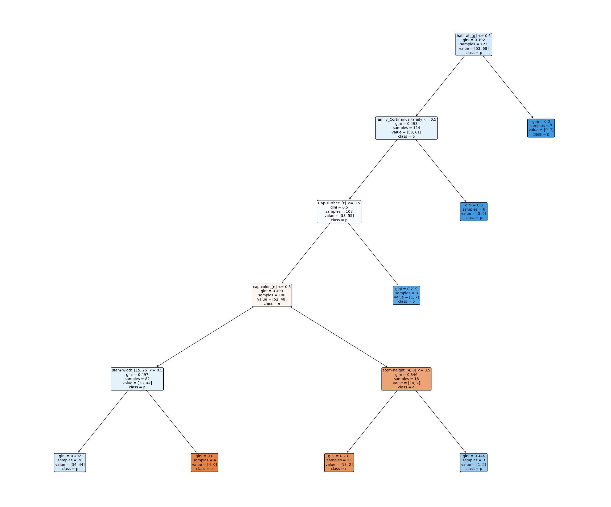
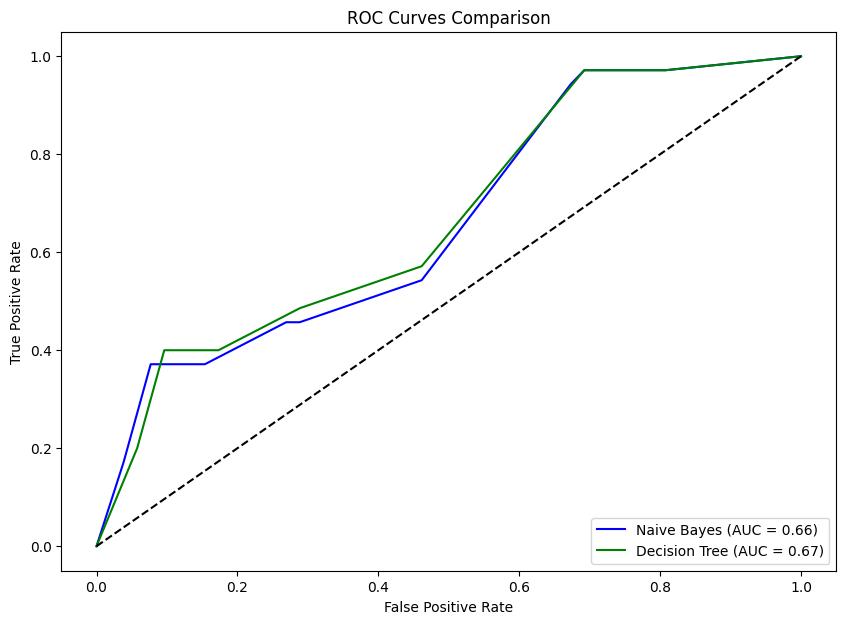
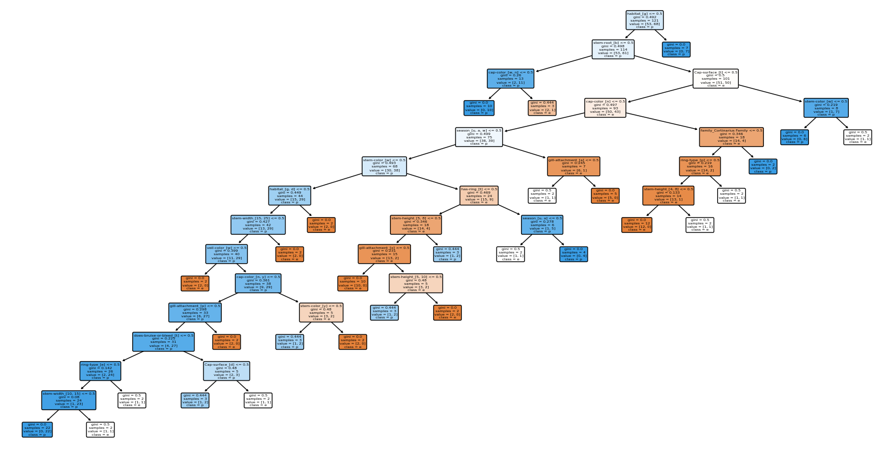

# Trend-Analysis
# Mushroom Edibility Prediction

This repository contains an assignment to train and evaluate both a Decision Tree and a Naive Bayes classifier on a dataset of mushrooms to predict whether they are edible or not based on their characteristics. The dataset consists of 20 predictors: 17 categorical and 3 numeric.

## Dataset

- **Files**: `mushroom_data.csv`, `mushroom_data_README.txt`
- **Label Column**: `class`
- **Predictor Columns**: `'family', 'name', 'cap-diameter', 'cap-shape', 'Cap-surface', 'cap-color', 'does-bruise-or-bleed', 'gill-attachment', 'gill-spacing', 'gill-color', 'stem-height', 'stem-width', 'stem-root', 'stem-surface', 'stem-color', 'veil-type', 'veil-color', 'has-ring', 'ring-type', 'Spore-print-color', 'habitat', 'season'`

## Project Tasks

### Task 1: Handle Multi-Valued Categorical Variables

- **Binary Split**: Use one-hot encoding for binary splits.
- **Multiway Split**: Use discretization methods like equal-width binning.

### Task 2: Train Naive Bayes Classifier

- **Categorical Naive Bayes**: Train on categorical predictors and identify top 4 predictive features.

### Task 3: Train Gaussian Naive Bayes Classifier

- **Gaussian Naive Bayes**: Train on numeric predictors.

### Task 4: Train Decision Tree Classifier

- **Decision Tree**: Train on the full dataset and visualize the learned tree.

### Task 5: Compare Models

- **Random Train-Test Split**: Compare Naive Bayes and Decision Tree classifiers using ROC curves and AUC.

## Installation

1. **Clone the repository**:

   ```bash
   git clone https://github.com/Pauravinagarkar/Trend-Analysis.git
   cd Trend-Analysis

2. **Install Dependencies:**:

   ```bash
    pip install -r requirements.txt

3. **Run Jupyter Notebook**:
    ```bash
      jupyter notebook Mushroom_Analysis.ipynb

## Steps to Follow:

 - **Data Preprocessing:**  Load and preprocess the dataset, handle multi-valued categorical variables.
 - **Train Models:** Train Naive Bayes and Decision Tree classifiers.
 - **Evaluate Models:** Compare models based on ROC curves and AUC. 

## Data Visualization:

-**Decision Tree Visualization**


-**ROC CURVE**



-**5 fold Method**


## Conclusion
The analysis reveals that both Naive Bayes and Decision Tree classifiers are effective in predicting mushroom edibility, with differences in performance highlighted by the ROC curves and AUC values.

   
